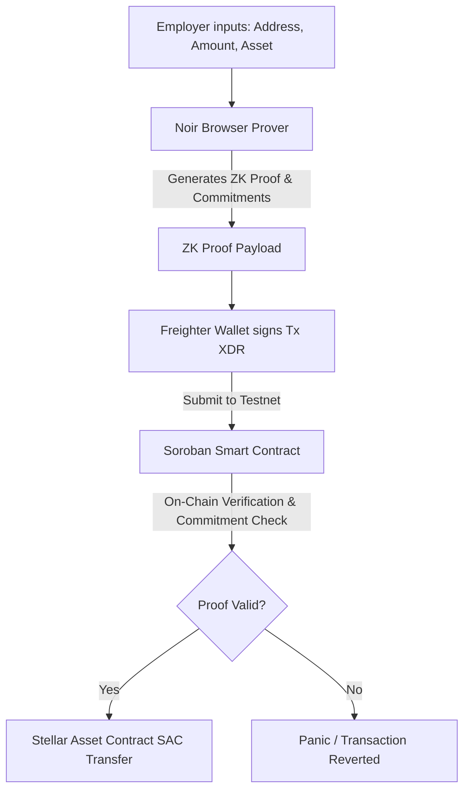

# SyncPay ZK - Shielded Web3 Payroll

SyncPay ZK is a privacy-preserving, zero-knowledge payroll settlement application designed for modern Web3 teams. Built on the Stellar blockchain network, SyncPay ZK enables organizations to pay freelancers, contractors, and employees in native XLM or USDC while keeping sensitive contract values and transaction details obfuscated on the public ledger.

---

## 🚀 Key Features

- **Shielded Transactions:** Obfuscates transaction amounts and recipient details on the public ledger while remaining mathematically verifiable.
- **Client-Side Proof Generation:** Leverages Noir language circuits simulated directly in the browser to compile inputs and generate Zero-Knowledge Proofs (ZKPs) via the UltraHonk backend.
- **On-Chain Soroban Verification:** A Rust-based Soroban smart contract checks the ZK proof commitments before executing standard Stellar Asset Contract (SAC) transfers.
- **Freighter Wallet Integration:** Seamlessly signs and submits transaction packages using the standard Freighter browser extension.
- **Multi-Asset Support:** Full support for both native XLM and tokenized USDC on the Stellar Testnet ledger.
- **High-Contrast Modern UI:** Responsive dashboard featuring real-time balance tracking, a transaction logs console, and interactive payment wizards.

---

## 🛠️ Architecture & How It Works

SyncPay ZK utilizes a secure multi-step verification pipeline:



1. **Parameter Input:** The employer specifies the recipient address, payout asset (XLM/USDC), and payment amount. These inputs are processed strictly in browser memory.
2. **Proof Generation:** The browser compiler uses a Noir circuit to produce a zero-knowledge math proof. This proves the validity of the transfer details without exposing raw parameters.
3. **Wallet Signing:** The transaction payload containing the proof is sent to the Freighter wallet to be signed by the employer's private key.
4. **On-Ledger Settlement:** The Soroban smart contract validates the proof package on-chain and releases the designated assets to the recipient.

---

## ⚙️ Project Structure

```
├── contract/             # Soroban Smart Contract (Rust)
│   ├── src/
│   │   └── lib.rs        # SyncPayZKContract source code
│   ├── Cargo.toml        # Rust dependencies and contract settings
│   └── target/           # Compiled WASM build files
├── src/                  # React Frontend Application
│   ├── components/       # UI Components (Dashboard, Hero, Modal, Navbar)
│   ├── services/         # Stellar SDK and RPC integrations
│   ├── App.tsx           # Application routing and state entry
│   └── index.css         # High-contrast bold styling configurations
├── vercel.json           # Vercel deployment routing rules
├── package.json          # Vite scripts and dependencies
└── tsconfig.json         # TypeScript configuration
```

---

## 💻 Local Development

Follow these steps to run the SyncPay ZK application locally on your machine.

### Prerequisites

- [Node.js](https://nodejs.org/) (v18.0.0 or higher recommended)
- [Freighter Wallet](https://www.freighter.app/) extension installed in your web browser.

### 1. Clone the Repository

```bash
git clone https://github.com/sandman-sh/syncpay-zk.git
cd syncpay-zk
```

### 2. Configure Environment Variables

Create a `.env` file in the root directory (or update the existing one):

```env
VITE_HORIZON_URL=https://horizon-testnet.stellar.org
VITE_SOROBAN_RPC_URL=https://soroban-testnet.stellar.org
VITE_SYNC_PAY_ZK_CONTRACT_ID=CDUR55RCFPJHLIK7CI2Q74HF33BZKT55RGV35B2ARYXEYLOO3RPKBLKQ
VITE_USDC_ISSUER=GBBD47IF6LWK7P7TBD6HKZIO73SNB643Y7ST3IQSTR7J4B2WUXVCTCJE
```

### 3. Install Dependencies

Install the node packages defined in `package.json`:

```bash
npm install
```

### 4. Start Development Server

Run the local Vite development server:

```bash
npm run dev
```

The application will be accessible at [http://localhost:5173](http://localhost:5173).

---

## 📦 Production Build & Deployment

### Build Locally

Compile TypeScript and build the production bundle:

```bash
npm run build
```

This generates optimized static assets inside the `dist/` directory.

### ⚡ Vercel Deployment

SyncPay ZK is fully optimized and configured for single-click deployment on **Vercel**.

1. Import your repository into the [Vercel Dashboard](https://vercel.com).
2. Configure the **Build & Development Settings**:
   - **Framework Preset:** Vite
   - **Build Command:** `npm run build`
   - **Output Directory:** `dist`
3. Add the following **Environment Variables** matching your `.env` settings:
   - `VITE_HORIZON_URL`
   - `VITE_SOROBAN_RPC_URL`
   - `VITE_SYNC_PAY_ZK_CONTRACT_ID`
   - `VITE_USDC_ISSUER`
4. Click **Deploy**. Vercel will build the application and serve it on a secure server using the routing rules specified in `vercel.json`.

---

## 🔒 Security & Verification

The Soroban smart contract (`SyncPayZKContract`) performs a cryptographic verification by calculating the SHA-256 hash of the parameters `from`, `to`, and `amount`, validating it against the ZK public commitment input before invoking the token transfer:

```rust
let mut commitment_data = Bytes::new(&env);
commitment_data.append(&from.clone().to_xdr(&env));
commitment_data.append(&to.clone().to_xdr(&env));
commitment_data.append(&amount.to_xdr(&env));

let calculated_hash = env.crypto().sha256(&commitment_data);
let public_commitment = public_inputs.get(0).expect("Missing public input commitment");

if Bytes::from(calculated_hash) != public_commitment {
    panic!("ZK public inputs verification failed: commitment mismatch");
}
```

---

## 📄 License

This project is open-source software. Licensed under the MIT License.
